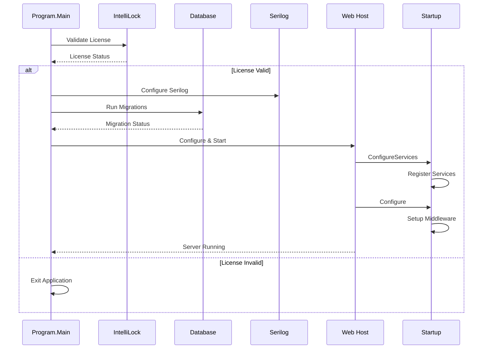
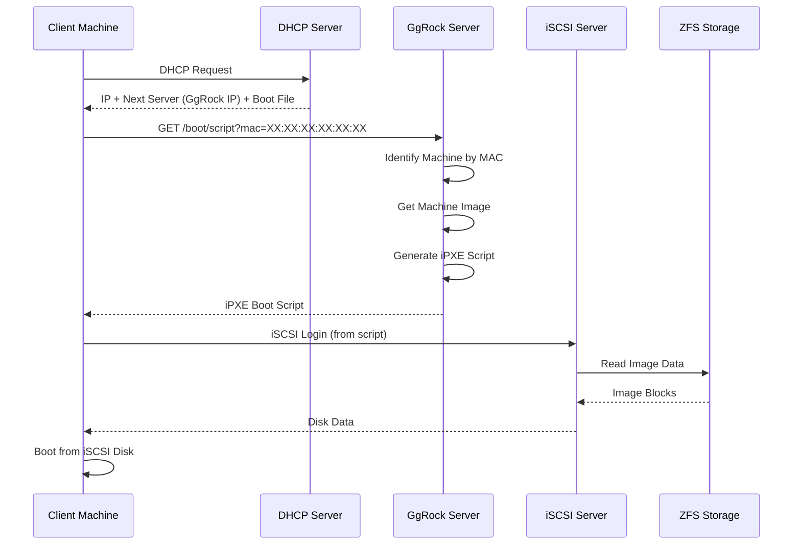
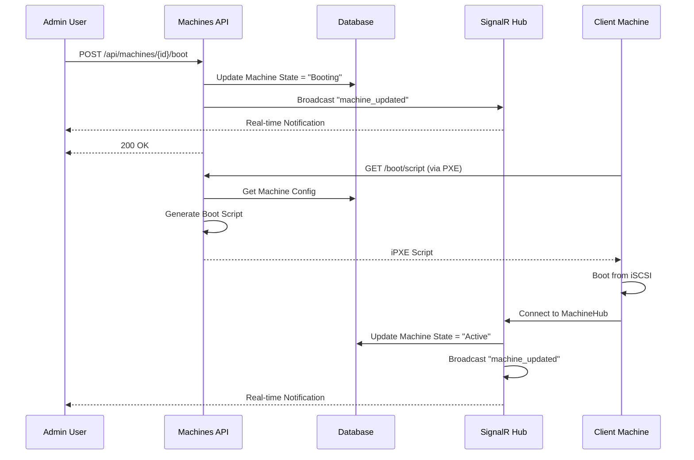
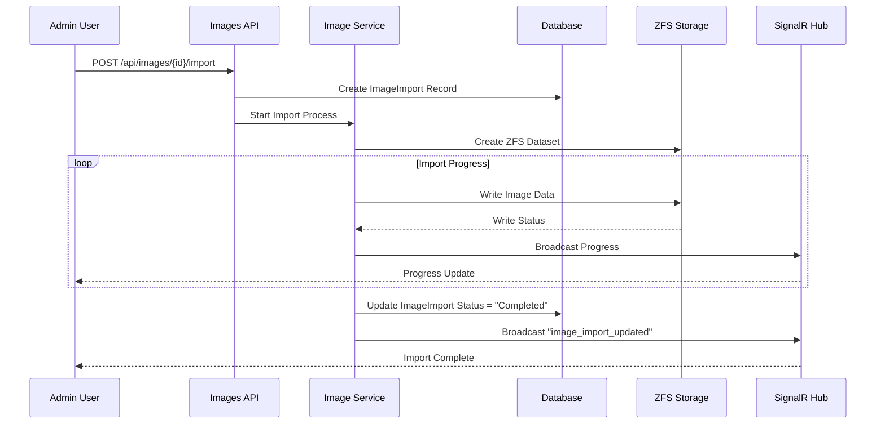
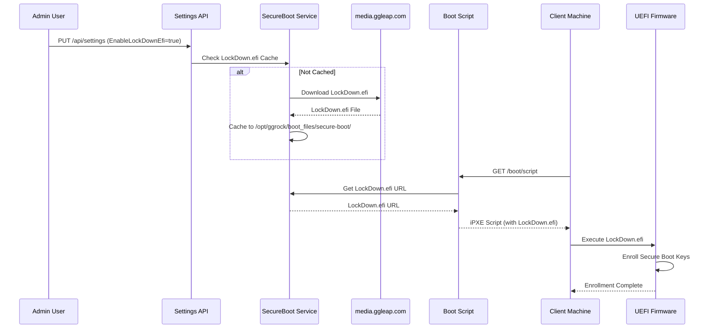
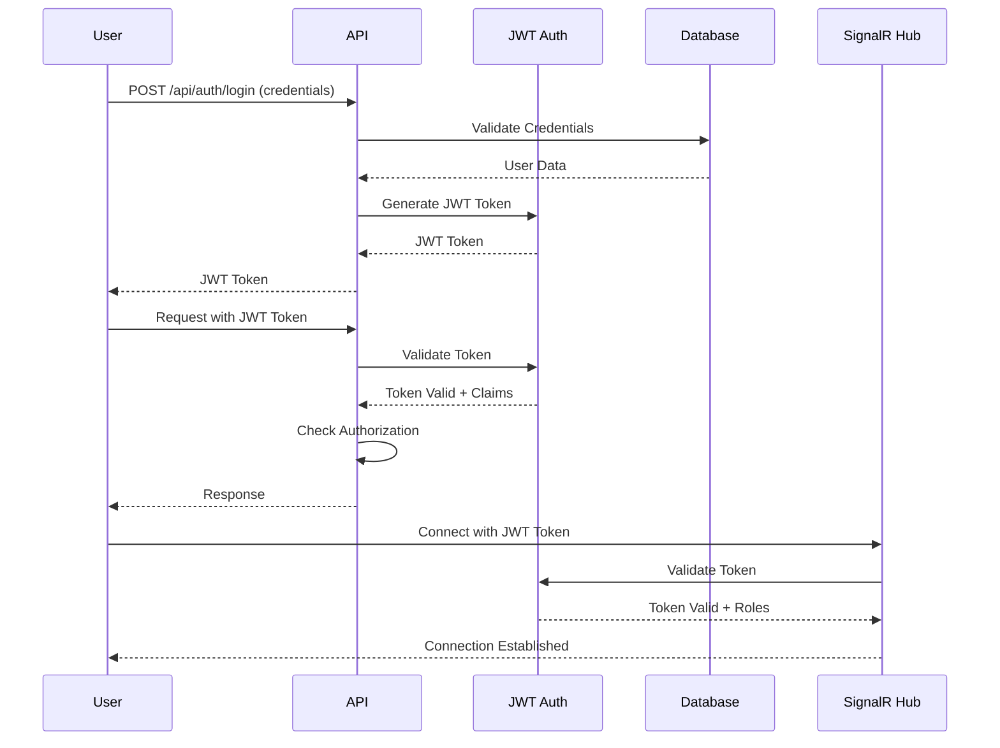
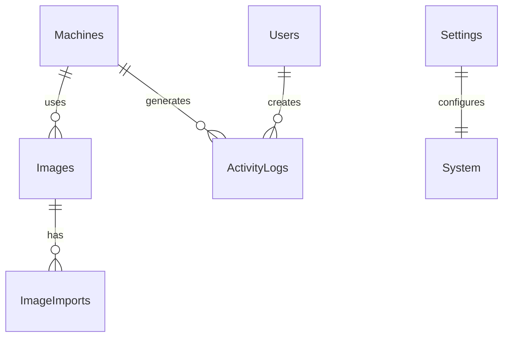
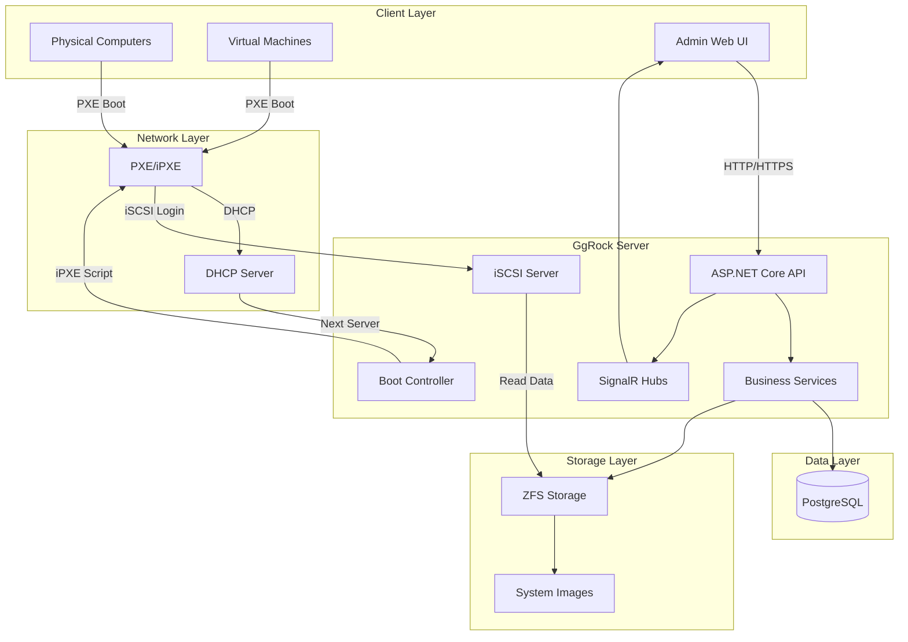
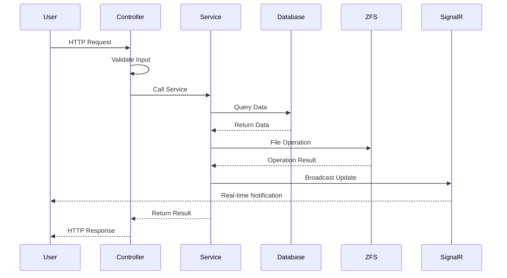
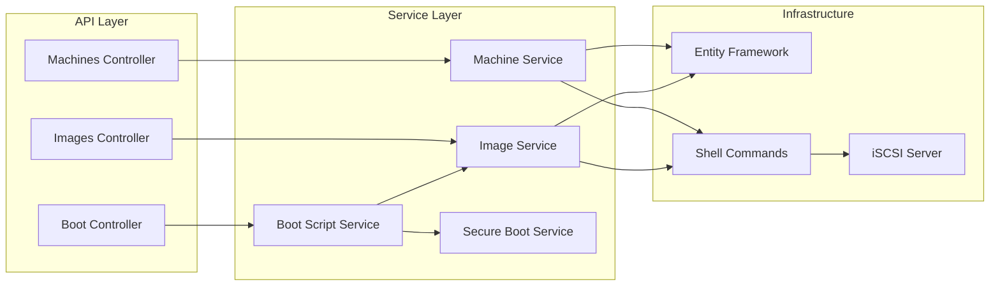

# GgRock.Api - Comprehensive Project Analysis

## 📋 Table of Contents

1. [Project Structure Analysis](#1-project-structure-analysis)
2. [File-by-File Breakdown](#2-file-by-file-breakdown)
3. [Function & Class Mapping](#3-function--class-mapping)
4. [API Route Mapping](#4-api-route-mapping)
5. [Application Logic & Flow Explanation](#5-application-logic--flow-explanation)
6. [Database Analysis](#6-database-analysis)
7. [Dependency Analysis](#7-dependency-analysis)
8. [Security Review](#8-security-review)
9. [Performance Review](#9-performance-review)
10. [Code Quality & Consistency Check](#10-code-quality--consistency-check)
11. [Missing Documentation Detection](#11-missing-documentation-detection)
12. [Full Documentation Package](#12-full-documentation-package)
13. [Technical Diagrams](#13-technical-diagrams)

---

## 1. Project Structure Analysis

### 1.1 Overview

**GgRock.Api** is a decompiled and obfuscated ASP.NET Core 6.0 Web API application for managing virtual machines (VMs) and physical computers (PCs) in a network boot environment.

**Key Statistics:**
- **Total Directories**: 1,234+ (obfuscated namespace folders)
- **Framework**: .NET Core 6.0 (netcoreapp6.0)
- **Language**: C# 12.0
- **Platform**: x64
- **Database**: PostgreSQL (Entity Framework Core)
- **Architecture**: RESTful API + SignalR Real-time Hub

### 1.2 Directory Structure

```
GgRock_decompiled/
├── RQ1fqrlZ4DOF08oX3Y/          # Program.cs (Main Entry Point)
│   └── itDiwNUpCPB0AOujDs.cs     # Program class
├── qDaWjuT3q2CBafvkcP/           # Startup.cs
│   └── anSFxTtjPegBMKTAJc.cs     # Startup class
├── Hc5syg3vcuVnWHJhEyB/          # Machines Controller
│   └── aj8EKn3NNnEXsIZNMGU.cs
├── c4spou3E6KR2AFvBquv/          # VMs Controller
│   └── MFRdoM3L4Mb8R7RTxLe.cs
├── CqHjcuVoirirBHWBThY/          # Clients Controller
│   └── Md0Y9oVyMJqam8Yp3Su.cs
├── nc04a53J0NPSwxDLAyW/          # Users Controller
│   └── zixghZ3Bi7oTf0x79Z9.cs
├── t8laPq3Ak87UUhqRRgc/          # Toolchain Controller
│   └── dhbRQW3Ci9OuJaKLjlt.cs
├── OA5a4bVK924SEAfOHI1/          # Array Controller
│   └── hI7MjWV2HTERV83Cy14.cs
├── HbdZWJVjGnyVoXcSH8P/          # Boot Controller (iPXE)
│   └── F6f2vYVbMYt4AVARZTx.cs
├── bvYZ8j5mi2gaISYEdau/          # Admin SignalR Hub
│   └── zUBcN054iJ72Sa5X8Te.cs
├── RLo8j55nTlDKlEsymQ6/          # Machine SignalR Hub
│   └── LDXTkw57vvp3uCos5CW.cs
├── GgRock.Data.Postgres/         # Database Context
│   └── GgRockContext.cs
├── xDmHVZDdUPaDZA7iqrj/          # String Decoder (Obfuscation)
│   └── sX4AtODe5doX96TRd9K.cs
├── kZd0FpDJ1nglb4ugdLV/          # iSCSI Server
│   └── Qg20KtDBIoIjV94LxNd.cs
├── lFvvTMhfZNc6XGk65GO/          # Boot Script Service
│   └── MpvOMNhhb8R2c0hYgbK.cs
├── SngPTjhdI2tATnSutSL/          # Secure Boot Service
│   └── rMdBxgheFZ3l9uKYW7k.cs
├── NW8T7ZqjFdYX7BwpAsP/           # Shell Command Executor
│   └── g5CxFFqbSwTgxY6cClN.cs
├── [1200+ obfuscated directories] # Services, DTOs, Utilities
├── GgRock.Api.csproj             # Project file
└── [Embedded Resources]           # Obfuscated string resources
    ├── a25ca4d8-9c83-4a1a-bebc-fdb1cb742470
    ├── 4dbe2789-8876-4f13-9be8-ce23532ff60f
    ├── 061b3b34-f5dd-46be-9517-ea9d6ccdd373
    └── 9bc945b0-3a73-4916-b4f7-6015b1023b2f
```

### 1.3 Major Components

#### Core Application
- **Entry Point**: `RQ1fqrlZ4DOF08oX3Y/itDiwNUpCPB0AOujDs.cs` (Program)
- **Startup**: `qDaWjuT3q2CBafvkcP/anSFxTtjPegBMKTAJc.cs` (Startup)
- **Database Context**: `GgRock.Data.Postgres/GgRockContext.cs`

#### API Controllers
- Machines, VMs, Clients, Users, Toolchain, Array, Images, Settings, Schedule, Features, Subscription, Activity Log, Boot, Server, Certificates, Partitions, Drives, ProductBoard, Batch Operations

#### SignalR Hubs
- Admin Hub (`bvYZ8j5mi2gaISYEdau/zUBcN054iJ72Sa5X8Te.cs`)
- Machine Hub (`RLo8j55nTlDKlEsymQ6/LDXTkw57vvp3uCos5CW.cs`)

#### Services
- Boot Script Service (iPXE generation)
- Secure Boot Service (LockDown.efi management)
- iSCSI Server (port 3260)
- Shell Command Executor (ZFS, system commands)
- String Decoder (obfuscation deobfuscation)

#### Domain Models
- `GgRock.Domain.SerializableTypes.*` - DTOs and serializable types
- `GgRock.SerializableTypes.Client.*` - Client-side DTOs

---

## 2. File-by-File Breakdown

### 2.1 Core Application Files

#### `RQ1fqrlZ4DOF08oX3Y/itDiwNUpCPB0AOujDs.cs` (Program.cs)

**Purpose**: Application entry point and host configuration

**Main Functions:**
- `CjxHjga9P()` - Main method
- License validation (IntelliLock)
- Database migration handling
- Serilog configuration
- Kestrel server setup

**Key Responsibilities:**
- Parse command-line arguments (`--skip-migration`, `--rollback`)
- Initialize logging (Serilog with Grafana Loki)
- Validate license before startup
- Run database migrations
- Configure and start web host

**Dependencies:**
- `Microsoft.AspNetCore.Hosting`
- `Serilog`
- `IntelliLock` (license validation)
- `Entity Framework Core`

---

#### `qDaWjuT3q2CBafvkcP/anSFxTtjPegBMKTAJc.cs` (Startup.cs)

**Purpose**: Application startup configuration and dependency injection

**Main Methods:**
- `ConfigureServices(IServiceCollection services)` - DI registration
- `Configure(IApplicationBuilder app, IWebHostEnvironment env)` - Middleware pipeline

**Registered Services:**
- Entity Framework Core (PostgreSQL)
- JWT Authentication
- SignalR Hubs
- FluentValidation
- Swagger/OpenAPI
- CORS
- SPA static files (Angular frontend)

**Middleware Pipeline:**
1. CORS
2. Authentication (JWT Bearer)
3. Authorization
4. MVC Controllers
5. SignalR Hubs
6. Swagger UI
7. SPA fallback
8. Request Logging (Serilog)

---

#### `GgRock.Data.Postgres/GgRockContext.cs`

**Purpose**: Entity Framework Core database context

**DbSets:**
- `Machines` (`QsmV5sUQilnmGG6bcay`) - Physical and virtual machines
- `Images` (`PK8ANvlcB9q3ZVZQJCv`) - System images
- `ImageImports` (`POHKBhltbKScBdRAMgg`) - Image import processes
- `Users` (`in6C67ULx9RjpxkkpYh`) - System users
- `Settings` (`nbqYWdUB3jJUXKjiKZR`) - System settings
- `Updates` (`mUSt4ZUZULY5BxoObA2`) - Update information

**Entity Configurations:**
- 30+ entity configurations applied in `OnModelCreating`
- PostgreSQL-specific configurations
- Indexes and relationships

---

### 2.2 API Controllers

#### `Hc5syg3vcuVnWHJhEyB/aj8EKn3NNnEXsIZNMGU.cs` (MachinesController)

**Route**: `/api/machines`  
**Authorization**: `[Authorize(Roles = "Admin")]`

**Main Endpoints:**
- `GET /api/machines` - List all machines
- `GET /api/machines/{id}` - Get machine by ID
- `POST /api/machines` - Create machine
- `PUT /api/machines/{id}` - Update machine
- `DELETE /api/machines/{id}` - Delete machine
- `POST /api/machines/{id}/boot` - Boot machine
- `POST /api/machines/{id}/shutdown` - Shutdown machine

**Key Features:**
- Machine state management (Offline/Booting/Active)
- PC and VM support
- Real-time SignalR notifications
- Writeback management

---

#### `HbdZWJVjGnyVoXcSH8P/F6f2vYVbMYt4AVARZTx.cs` (BootController)

**Route**: `/boot`  
**Authorization**: `[AllowAnonymous]` (for iPXE boot)

**Main Endpoints:**
- `GET /boot/script?mac={mac}&ip={ip}&nic={nic}&if={interface}` - Generate iPXE boot script

**Key Features:**
- Dynamic iPXE script generation
- Machine identification by MAC address
- Image selection based on machine configuration
- Secure Boot support (LockDown.efi URL injection)
- iSCSI target configuration

**Flow:**
1. Client machine boots via PXE/iPXE
2. DHCP provides next-server (GgRock server IP)
3. iPXE requests `/boot/script` with MAC address
4. Server identifies machine and generates custom boot script
5. Script includes iSCSI target, image path, Secure Boot enrollment

---

#### `c4spou3E6KR2AFvBquv/MFRdoM3L4Mb8R7RTxLe.cs` (VMsController)

**Route**: `/api/vms`  
**Authorization**: `[Authorize(Roles = "Admin")]`

**Main Endpoints:**
- `GET /api/vms` - List VMs
- `POST /api/vms` - Create VM
- `PUT /api/vms/{id}` - Update VM
- `DELETE /api/vms/{id}` - Delete VM
- VM-specific operations (snapshot, clone, etc.)

---

#### `t8laPq3Ak87UUhqRRgc/dhbRQW3Ci9OuJaKLjlt.cs` (ToolchainController)

**Route**: `/api/toolchain`  
**Authorization**: `[Authorize(Roles = "Admin")]`

**Main Endpoints:**
- `GET /api/toolchain` - Get toolchain status
- `POST /api/toolchain/download` - Download toolchain
- `GET /api/toolchain/progress` - Get download progress
- `GET /api/toolchain/version` - Get toolchain version

**Features:**
- Progress tracking via SignalR
- State management
- Version control

---

#### `OA5a4bVK924SEAfOHI1/hI7MjWV2HTERV83Cy14.cs` (ArrayController)

**Route**: `/api/array`  
**Authorization**: `[Authorize(Roles = "Admin")]`

**Main Endpoints:**
- `GET /api/array` - Get array status
- `POST /api/array/rebuild` - Rebuild array
- `POST /api/array/trim` - Trim array
- `GET /api/array/progress` - Get operation progress
- `GET /api/array/space` - Get space information

**Features:**
- ZFS array management
- Rebuild and trim operations
- Progress tracking
- Space threshold monitoring

---

### 2.3 SignalR Hubs

#### `bvYZ8j5mi2gaISYEdau/zUBcN054iJ72Sa5X8Te.cs` (AdminHub)

**Route**: `/hubs/admin`  
**Authorization**: `[Authorize(Roles = "Admin")]`

**Events:**
- `OnConnectedAsync()` - Sends connection ID to client

**Client Methods (Server → Client):**
- All SignalR events broadcasted to Admin clients

---

#### `RLo8j55nTlDKlEsymQ6/LDXTkw57vvp3uCos5CW.cs` (MachineHub)

**Route**: `/hubs/machine`  
**Authorization**: `[Authorize(Roles = "Machine")]`

**Events:**
- `OnConnectedAsync()` - Machine connection
- Machine-specific methods for status updates

**Client Methods (Server → Client):**
- Machine-specific notifications

---

### 2.4 Services

#### `lFvvTMhfZNc6XGk65GO/MpvOMNhhb8R2c0hYgbK.cs` (BootScriptService)

**Purpose**: Generate iPXE boot scripts dynamically

**Main Method:**
- `Q4SGtNtlhtu()` - Generate boot script for machine

**Parameters:**
- Machine configuration
- Image path
- iSCSI target
- Secure Boot LockDown.efi URL
- Network interface information

**Output:**
- iPXE script with:
  - iSCSI login commands
  - Image boot configuration
  - Secure Boot enrollment (if enabled)
  - Network configuration

---

#### `SngPTjhdI2tATnSutSL/rMdBxgheFZ3l9uKYW7k.cs` (SecureBootService)

**Purpose**: Manage Secure Boot enrollment via LockDown.efi

**Main Methods:**
- `dV9GtftPN9n()` - Get LockDown.efi boot URL
- Download and cache LockDown.efi from `https://media.ggleap.com/ggrock/secure-boot/LockDown.efi`
- Store in `/opt/ggrock/boot_files/secure-boot/LockDown.efi`

**Features:**
- Automatic download and caching
- URL generation for iPXE scripts
- Secure Boot key enrollment support

---

#### `kZd0FpDJ1nglb4ugdLV/Qg20KtDBIoIjV94LxNd.cs` (iSCSIServer)

**Purpose**: iSCSI target server for network boot disk access

**Features:**
- TCP listener on port 3260
- iSCSI protocol implementation
- Disk image serving
- Connection management

**Classes:**
- `eXuVUkDWHYoLRVNJYrw` - TcpListener initialization
- `hWk2dJDZLjp589rFbjf : TcpListener` - Custom TCP listener

---

#### `NW8T7ZqjFdYX7BwpAsP/g5CxFFqbSwTgxY6cClN.cs` (ShellCommandExecutor)

**Purpose**: Execute shell commands with progress tracking

**Features:**
- Execute shell commands (bash/sh)
- Progress tracking for long-running operations
- Cancellation support
- Output streaming

**Used For:**
- ZFS operations (`zpool`, `zfs`)
- iSCSI monitoring (`ss -H -t4ni state established "( sport = :3260 )"`)
- System administration commands

---

#### `xDmHVZDdUPaDZA7iqrj/sX4AtODe5doX96TRd9K.cs` (StringDecoder)

**Purpose**: Deobfuscate obfuscated strings

**Main Methods:**
- `qEaGfG4O4Du(int index)` - Get deobfuscated string by index
- `WsBGdzmG64Y(int index)` - Validate string index

**Implementation:**
- Reads from embedded resource `9bc945b0-3a73-4916-b4f7-6015b1023b2f`
- Decrypts and decodes strings
- Caches decoded strings

---

### 2.5 Domain Models

#### `GgRock.Domain.SerializableTypes.*`

**Purpose**: DTOs and serializable types for API communication

**Key Types:**
- `ActivityLogs` - Activity logging types
- `FeatureToggles` - Feature flag types
- `Toolchain` - Toolchain DTOs
- `Machines` - Machine DTOs
- `Images` - Image DTOs

---

## 3. Function & Class Mapping

### 3.1 Global Class Index

| Obfuscated Name | Clear Name | Namespace | Purpose |
|----------------|------------|-----------|---------|
| `itDiwNUpCPB0AOujDs` | `Program` | `RQ1fqrlZ4DOF08oX3Y` | Application entry point |
| `anSFxTtjPegBMKTAJc` | `Startup` | `qDaWjuT3q2CBafvkcP` | Startup configuration |
| `aj8EKn3NNnEXsIZNMGU` | `MachinesController` | `Hc5syg3vcuVnWHJhEyB` | Machines API |
| `MFRdoM3L4Mb8R7RTxLe` | `VMsController` | `c4spou3E6KR2AFvBquv` | VMs API |
| `F6f2vYVbMYt4AVARZTx` | `BootController` | `HbdZWJVjGnyVoXcSH8P` | iPXE boot script |
| `zUBcN054iJ72Sa5X8Te` | `AdminHub` | `bvYZ8j5mi2gaISYEdau` | Admin SignalR hub |
| `LDXTkw57vvp3uCos5CW` | `MachineHub` | `RLo8j55nTlDKlEsymQ6` | Machine SignalR hub |
| `sX4AtODe5doX96TRd9K` | `StringDecoder` | `xDmHVZDdUPaDZA7iqrj` | String deobfuscation |
| `Qg20KtDBIoIjV94LxNd` | `iSCSIServer` | `kZd0FpDJ1nglb4ugdLV` | iSCSI target server |
| `MpvOMNhhb8R2c0hYgbK` | `BootScriptService` | `lFvvTMhfZNc6XGk65GO` | iPXE script generation |
| `rMdBxgheFZ3l9uKYW7k` | `SecureBootService` | `SngPTjhdI2tATnSutSL` | Secure Boot management |
| `g5CxFFqbSwTgxY6cClN` | `ShellCommandExecutor` | `NW8T7ZqjFdYX7BwpAsP` | Shell command execution |
| `GgRockContext` | `GgRockContext` | `GgRock.Data.Postgres` | EF Core database context |

### 3.2 Key Function Mappings

| Obfuscated Method | Clear Method | Class | Purpose |
|-------------------|--------------|-------|---------|
| `CjxHjga9P` | `Main` | `Program` | Application entry point |
| `qEaGfG4O4Du` | `GetString` | `StringDecoder` | Get deobfuscated string |
| `Q4SGtNtlhtu` | `GenerateBootScript` | `BootScriptService` | Generate iPXE script |
| `dV9GtftPN9n` | `GetLockDownEfiBootUrlAsync` | `SecureBootService` | Get Secure Boot EFI URL |

---

## 4. API Route Mapping

### 4.1 Complete API Endpoints

#### Machines API (`/api/machines`)

| Method | Route | Description | Auth | Params |
|--------|-------|-------------|------|--------|
| GET | `/api/machines` | List all machines | Admin | - |
| GET | `/api/machines/{id}` | Get machine by ID | Admin | `id: Guid` |
| POST | `/api/machines` | Create machine | Admin | Body: `MachineDto` |
| PUT | `/api/machines/{id}` | Update machine | Admin | `id: Guid`, Body: `MachineDto` |
| DELETE | `/api/machines/{id}` | Delete machine | Admin | `id: Guid` |
| POST | `/api/machines/{id}/boot` | Boot machine | Admin | `id: Guid` |
| POST | `/api/machines/{id}/shutdown` | Shutdown machine | Admin | `id: Guid` |

**Example Request:**
```http
POST /api/machines
Authorization: Bearer {jwt_token}
Content-Type: application/json

{
  "name": "PC-001",
  "type": "PC",
  "macAddress": "00:11:22:33:44:55",
  "imageId": "guid-here"
}
```

**Example Response:**
```json
{
  "id": "guid-here",
  "name": "PC-001",
  "type": "PC",
  "state": "Offline",
  "macAddress": "00:11:22:33:44:55",
  "imageId": "guid-here",
  "createdAt": "2024-01-01T00:00:00Z"
}
```

---

#### Boot API (`/boot`)

| Method | Route | Description | Auth | Params |
|--------|-------|-------------|------|--------|
| GET | `/boot/script` | Generate iPXE boot script | Anonymous | `mac: string`, `ip: string`, `nic?: string`, `if?: string` |

**Example Request:**
```http
GET /boot/script?mac=00:11:22:33:44:55&ip=192.168.1.100&nic=eth0
```

**Example Response (iPXE script):**
```ipxe
#!ipxe
set base-url http://192.168.1.10:5000
kernel ${base-url}/images/windows-10/vmlinuz
initrd ${base-url}/images/windows-10/initrd.img
boot
```

---

#### VMs API (`/api/vms`)

| Method | Route | Description | Auth | Params |
|--------|-------|-------------|------|--------|
| GET | `/api/vms` | List all VMs | Admin | - |
| GET | `/api/vms/{id}` | Get VM by ID | Admin | `id: Guid` |
| POST | `/api/vms` | Create VM | Admin | Body: `VMDto` |
| PUT | `/api/vms/{id}` | Update VM | Admin | `id: Guid`, Body: `VMDto` |
| DELETE | `/api/vms/{id}` | Delete VM | Admin | `id: Guid` |

---

#### Toolchain API (`/api/toolchain`)

| Method | Route | Description | Auth | Params |
|--------|-------|-------------|------|--------|
| GET | `/api/toolchain` | Get toolchain status | Admin | - |
| POST | `/api/toolchain/download` | Download toolchain | Admin | - |
| GET | `/api/toolchain/progress` | Get download progress | Admin | - |
| GET | `/api/toolchain/version` | Get toolchain version | Admin | - |

---

#### Array API (`/api/array`)

| Method | Route | Description | Auth | Params |
|--------|-------|-------------|------|--------|
| GET | `/api/array` | Get array status | Admin | - |
| POST | `/api/array/rebuild` | Rebuild array | Admin | - |
| POST | `/api/array/trim` | Trim array | Admin | - |
| GET | `/api/array/progress` | Get operation progress | Admin | - |
| GET | `/api/array/space` | Get space information | Admin | - |

---

#### Images API (`/api/images`)

| Method | Route | Description | Auth | Params |
|--------|-------|-------------|------|--------|
| GET | `/api/images` | List all images | Admin | - |
| GET | `/api/images/{id}` | Get image by ID | Admin | `id: Guid` |
| POST | `/api/images` | Create image | Admin | Body: `ImageDto` |
| POST | `/api/images/{id}/import` | Import image | Admin | `id: Guid` |
| POST | `/api/images/{id}/backup` | Backup image | Admin | `id: Guid` |
| POST | `/api/images/{id}/restore` | Restore image | Admin | `id: Guid` |

---

#### Settings API (`/api/settings`)

| Method | Route | Description | Auth | Params |
|--------|-------|-------------|------|--------|
| GET | `/api/settings` | Get settings | Admin | - |
| PUT | `/api/settings` | Update settings | Admin | Body: `SettingsDto` |

**Settings Include:**
- `EnableLockDownEfi` - Enable Secure Boot auto enrollment
- `SecureBootLockDownEfiUrl` - URL for LockDown.efi

---

#### Activity Log API (`/api/activityLog`)

| Method | Route | Description | Auth | Params |
|--------|-------|-------------|------|--------|
| GET | `/api/activityLog` | List activity logs | Admin | `page?: int`, `pageSize?: int` |
| GET | `/api/activityLog/{id}` | Get activity log by ID | Admin | `id: Guid` |

---

#### Features API (`/api/features`)

| Method | Route | Description | Auth | Params |
|--------|-------|-------------|------|--------|
| GET | `/api/features` | List feature toggles | Admin | - |
| PUT | `/api/features/{name}` | Update feature toggle | Admin | `name: string`, Body: `FeatureToggleDto` |

---

#### Subscription API (`/api/subscription`)

| Method | Route | Description | Auth | Params |
|--------|-------|-------------|------|--------|
| GET | `/api/subscription` | Get subscription status | Admin | - |
| PUT | `/api/subscription` | Update subscription | Admin | Body: `SubscriptionDto` |

---

#### Schedule API (`/api/schedule`)

| Method | Route | Description | Auth | Params |
|--------|-------|-------------|------|--------|
| GET | `/api/schedule` | List scheduled actions | Admin | - |
| POST | `/api/schedule` | Create scheduled action | Admin | Body: `ScheduledActionDto` |
| DELETE | `/api/schedule/{id}` | Delete scheduled action | Admin | `id: Guid` |

---

#### Server API (`/api/server`)

| Method | Route | Description | Auth | Params |
|--------|-------|-------------|------|--------|
| GET | `/api/server/info` | Get server information | Admin | - |
| GET | `/api/server/ram` | Get RAM usage | Admin | - |

---

#### Server Commands API (`/api/server/commands`)

| Method | Route | Description | Auth | Params |
|--------|-------|-------------|------|--------|
| POST | `/api/server/commands/execute` | Execute shell command | Admin | Body: `CommandDto` |
| GET | `/api/server/commands/{id}/progress` | Get command progress | Admin | `id: Guid` |

---

#### Certificates API (`/api/certificates/ssl`)

| Method | Route | Description | Auth | Params |
|--------|-------|-------------|------|--------|
| GET | `/api/certificates/ssl` | List SSL certificates | Admin | - |
| POST | `/api/certificates/ssl` | Upload SSL certificate | Admin | Body: `CertificateDto` |

---

#### Partitions API (`/api/partitions`)

| Method | Route | Description | Auth | Params |
|--------|-------|-------------|------|--------|
| GET | `/api/partitions` | List partitions | Admin | - |
| GET | `/api/partitions/{id}` | Get partition by ID | Admin | `id: Guid` |

---

#### Drives API (`/api/drives`)

| Method | Route | Description | Auth | Params |
|--------|-------|-------------|------|--------|
| GET | `/api/drives` | List drives | Admin | - |
| GET | `/api/drives/{id}` | Get drive by ID | Admin | `id: Guid` |

---

#### Batch Image Operations API (`/api/batchImageOperations`)

| Method | Route | Description | Auth | Params |
|--------|-------|-------------|------|--------|
| POST | `/api/batchImageOperations` | Execute batch operation | Admin | Body: `BatchOperationDto` |

---

#### ProductBoard API (`/api/productboard`)

| Method | Route | Description | Auth | Params |
|--------|-------|-------------|------|--------|
| GET | `/api/productboard` | Get ProductBoard data | Admin | - |

---

### 4.2 Authentication & Authorization

**JWT Bearer Token Authentication:**
- Token obtained via login endpoint (not visible in decompiled code)
- Token contains user claims and roles
- Validated via `Microsoft.AspNetCore.Authentication.JwtBearer`

**Roles:**
- `Admin` - Full administrative access
- `Machine` - Machine connection access (SignalR)
- `User` - Standard user access

**Authorization Attributes:**
- `[Authorize]` - Requires authentication
- `[Authorize(Roles = "Admin")]` - Requires Admin role
- `[Authorize(Roles = "Machine")]` - Requires Machine role
- `[AllowAnonymous]` - No authentication required (Boot API)

---

### 4.3 Error Handling

**Standard HTTP Status Codes:**
- `200 OK` - Success
- `201 Created` - Resource created
- `400 Bad Request` - Invalid request
- `401 Unauthorized` - Authentication required
- `403 Forbidden` - Insufficient permissions
- `404 Not Found` - Resource not found
- `500 Internal Server Error` - Server error
- `402 Payment Required` - Subscription required (custom)

**Error Response Format:**
```json
{
  "error": "Error message",
  "details": "Detailed error information",
  "statusCode": 400
}
```

---

## 5. Application Logic & Flow Explanation

### 5.1 Application Startup Flow



### 5.2 Network Boot Flow (PXE/iPXE)



### 5.3 Machine Boot Flow



### 5.4 Image Import Flow



### 5.5 Secure Boot Enrollment Flow



### 5.6 Authentication & Session Flow



---

## 6. Database Analysis

### 6.1 Entity Models

#### Machines (`QsmV5sUQilnmGG6bcay`)

**Purpose**: Represents physical and virtual machines

**Key Properties:**
- `Id` (Guid) - Primary key
- `Name` (string) - Machine name
- `Type` (enum) - PC or VM
- `State` (enum) - Offline, Booting, Active
- `MacAddress` (string) - MAC address for identification
- `ImageId` (Guid?) - Associated system image
- `IscsciTarget` (string?) - iSCSI target name
- `SecureBootEnabled` (bool?) - Secure Boot status
- `CreatedAt` (DateTime) - Creation timestamp
- `UpdatedAt` (DateTime) - Last update timestamp

**Relationships:**
- One-to-Many with Images (via ImageId)
- One-to-Many with ActivityLogs

---

#### Images (`PK8ANvlcB9q3ZVZQJCv`)

**Purpose**: System images for machines

**Key Properties:**
- `Id` (Guid) - Primary key
- `Name` (string) - Image name
- `Path` (string) - ZFS dataset path
- `Size` (long) - Image size in bytes
- `CreatedAt` (DateTime) - Creation timestamp
- `UpdatedAt` (DateTime) - Last update timestamp

**Relationships:**
- One-to-Many with Machines
- One-to-Many with ImageImports

---

#### ImageImports (`POHKBhltbKScBdRAMgg`)

**Purpose**: Track image import processes

**Key Properties:**
- `Id` (Guid) - Primary key
- `ImageId` (Guid) - Associated image
- `Status` (enum) - Pending, InProgress, Completed, Failed
- `Progress` (double) - Import progress (0-100)
- `StartedAt` (DateTime?) - Start timestamp
- `CompletedAt` (DateTime?) - Completion timestamp

**Relationships:**
- Many-to-One with Images

---

#### Users (`in6C67ULx9RjpxkkpYh`)

**Purpose**: System users (ASP.NET Core Identity)

**Key Properties:**
- `Id` (Guid) - Primary key
- `UserName` (string) - Username
- `Email` (string) - Email address
- `PasswordHash` (string) - Hashed password
- `Roles` (collection) - User roles

**Relationships:**
- One-to-Many with ActivityLogs

---

#### Settings (`nbqYWdUB3jJUXKjiKZR`)

**Purpose**: System-wide settings

**Key Properties:**
- `Id` (Guid) - Primary key
- `Key` (string) - Setting key
- `Value` (string) - Setting value (JSON)
- `UpdatedAt` (DateTime) - Last update timestamp

**Known Settings:**
- `EnableLockDownEfi` - Secure Boot auto enrollment
- `SecureBootLockDownEfiUrl` - LockDown.efi URL

---

#### Updates (`mUSt4ZUZULY5BxoObA2`)

**Purpose**: System update information

**Key Properties:**
- `Id` (Guid) - Primary key
- `Version` (string) - Update version
- `ReleasedAt` (DateTime) - Release date
- `Description` (string) - Update description

---

### 6.2 Database Relationships



### 6.3 Entity Framework Configurations

**Configuration Classes:**
- 30+ entity configuration classes applied in `OnModelCreating`
- PostgreSQL-specific configurations
- Indexes on frequently queried columns (MAC address, ImageId, etc.)
- Relationships and foreign keys

**Migrations:**
- Entity Framework Migrations supported
- Automatic migration on startup (unless `--skip-migration`)
- Rollback support via `--rollback` argument
- Migration history tracked in `__EFMigrationsHistory` table

### 6.4 Data Integrity

**Potential Issues:**
1. **Cascade Deletes**: Need to verify cascade delete behavior for Images → Machines
2. **Orphaned Records**: ImageImports may reference deleted Images
3. **Concurrency**: No explicit optimistic concurrency control visible
4. **Transactions**: Need to verify transaction boundaries for complex operations

**Recommendations:**
- Add foreign key constraints with appropriate cascade rules
- Implement soft deletes for critical entities
- Add optimistic concurrency tokens
- Use transactions for multi-entity operations

---

## 7. Dependency Analysis

### 7.1 Complete Dependency List

| Package | Version | Purpose | Usage |
|---------|---------|---------|-------|
| **Microsoft.AspNetCore.*** | 6.0 | ASP.NET Core framework | Core web framework |
| **Microsoft.EntityFrameworkCore** | 6.0 | ORM | Database access |
| **Npgsql.EntityFrameworkCore.PostgreSQL** | 6.0 | PostgreSQL provider | Database provider |
| **Serilog** | Latest | Structured logging | Application logging |
| **Serilog.Sinks.Grafana.Loki** | Latest | Loki sink | Log aggregation |
| **Swashbuckle.AspNetCore** | Latest | Swagger/OpenAPI | API documentation |
| **FluentValidation** | Latest | Model validation | Input validation |
| **Polly** | Latest | Resilience patterns | Retry policies |
| **BCrypt.Net-Next** | Latest | Password hashing | User authentication |
| **Newtonsoft.Json** | Latest | JSON serialization | JSON handling |
| **NodaTime** | Latest | Date/time library | Time handling |
| **Websocket.Client** | Latest | WebSocket client | External WebSocket |
| **Renci.SshNet** | Latest | SSH client | SSH operations |
| **Ical.Net** | Latest | iCalendar | Calendar events |
| **CsvHelper** | Latest | CSV parsing | CSV file handling |
| **System.Reactive** | Latest | Reactive extensions | Reactive programming |
| **System.Linq.Async** | Latest | Async LINQ | Async queries |
| **IntelliLock** | Unknown | License validation | License checking |

### 7.2 Dependency Usage Analysis

#### Core Framework Dependencies
- **Microsoft.AspNetCore.*** - Essential for web API
- **Microsoft.EntityFrameworkCore** - Essential for database access
- **Npgsql** - Essential for PostgreSQL support

#### Logging Dependencies
- **Serilog** - Primary logging framework
- **Serilog.Sinks.Grafana.Loki** - Log aggregation (optional, can be removed if not using Loki)

#### API Documentation
- **Swashbuckle.AspNetCore** - Swagger/OpenAPI (development only, can be conditionally loaded)

#### Validation
- **FluentValidation** - Input validation (essential)

#### Resilience
- **Polly** - Retry and circuit breaker patterns (useful but can be replaced with custom implementation)

#### Authentication
- **BCrypt.Net-Next** - Password hashing (essential)
- **Microsoft.AspNetCore.Authentication.JwtBearer** - JWT authentication (essential)

#### Serialization
- **Newtonsoft.Json** - JSON serialization (can be replaced with System.Text.Json in .NET 6)

#### Utilities
- **NodaTime** - Date/time handling (can be replaced with native DateTime if not needed)
- **Websocket.Client** - External WebSocket client (only if connecting to external WebSocket)
- **Renci.SshNet** - SSH operations (only if SSH functionality is used)
- **Ical.Net** - iCalendar support (only if calendar functionality is used)
- **CsvHelper** - CSV parsing (only if CSV import/export is used)
- **System.Reactive** - Reactive extensions (only if reactive patterns are used)
- **System.Linq.Async** - Async LINQ (useful but can be replaced with native async/await)

#### License
- **IntelliLock** - License validation (proprietary, cannot be removed without breaking license check)

### 7.3 Unused Dependencies

**Potentially Unused:**
- `Websocket.Client` - If no external WebSocket connections are made
- `Ical.Net` - If calendar functionality is not used
- `CsvHelper` - If CSV import/export is not used
- `System.Reactive` - If reactive patterns are not used

**Recommendation**: Audit codebase to confirm usage before removal.

### 7.4 Outdated Dependencies

**Consider Upgrading:**
- All dependencies should be checked for security updates
- `Newtonsoft.Json` can be replaced with `System.Text.Json` (native in .NET 6)
- Consider upgrading to .NET 8 for better performance and security

### 7.5 Security Considerations

**Dependencies with Known Vulnerabilities:**
- Regularly audit dependencies with `dotnet list package --vulnerable`
- Use Dependabot or similar tools for automated updates
- Review security advisories for all dependencies

---

## 8. Security Review

### 8.1 Authentication & Authorization

#### ✅ Strengths
- JWT Bearer token authentication
- Role-based authorization (Admin, Machine, User)
- Password hashing with BCrypt

#### ⚠️ Potential Issues
1. **Token Expiration**: Need to verify token expiration and refresh mechanism
2. **Token Storage**: Client-side token storage security (not server-controlled)
3. **Role Validation**: Ensure roles are validated on every request
4. **Machine Role**: Machine role authentication needs strong validation (MAC address, IP, etc.)

**Recommendations:**
- Implement token refresh mechanism
- Add token revocation support
- Validate machine connections with additional factors (MAC address, certificate)
- Implement rate limiting on authentication endpoints

---

### 8.2 Input Validation

#### ✅ Strengths
- FluentValidation for model validation
- ASP.NET Core model validation

#### ⚠️ Potential Issues
1. **MAC Address Validation**: Verify MAC address format validation
2. **IP Address Validation**: Verify IP address validation in boot script
3. **File Upload Validation**: If file uploads exist, verify file type and size validation
4. **SQL Injection**: Entity Framework Core provides parameterized queries, but need to verify raw SQL usage

**Recommendations:**
- Add strict validation for MAC addresses (regex pattern)
- Validate IP addresses (IPv4/IPv6)
- Implement file upload restrictions (type, size, scanning)
- Audit all database queries for parameterization

---

### 8.3 Secrets & Configuration

#### ⚠️ Potential Issues
1. **License Key Storage**: License key stored in configuration (Base64 encoded, not encrypted)
2. **Connection Strings**: PostgreSQL connection string in configuration
3. **JWT Secret**: JWT signing key in configuration
4. **Embedded Resources**: Obfuscated strings in embedded resources (not a security issue, but obfuscation)

**Recommendations:**
- Use Azure Key Vault, AWS Secrets Manager, or similar for secrets
- Encrypt sensitive configuration values
- Use environment variables for secrets (not in appsettings.json)
- Implement secret rotation

---

### 8.4 API Security

#### ✅ Strengths
- HTTPS support (Kestrel configuration)
- CORS configuration
- Authorization attributes on controllers

#### ⚠️ Potential Issues
1. **Boot API Anonymous Access**: `/boot/script` endpoint is anonymous (required for PXE boot, but needs protection)
2. **Rate Limiting**: No visible rate limiting implementation
3. **Request Size Limits**: Need to verify request size limits
4. **CORS Configuration**: Verify CORS origins are restricted

**Recommendations:**
- Implement rate limiting (especially for boot endpoint)
- Add IP whitelist for boot endpoint (if possible)
- Implement request size limits
- Restrict CORS origins to known domains
- Add API versioning

---

### 8.5 Secure Boot

#### ✅ Strengths
- Secure Boot enrollment support
- LockDown.efi download and caching

#### ⚠️ Potential Issues
1. **LockDown.efi Integrity**: No visible hash validation for downloaded LockDown.efi
2. **HTTPS for Download**: Verify LockDown.efi is downloaded over HTTPS
3. **Certificate Validation**: Verify certificate chain validation

**Recommendations:**
- Add SHA-256 hash validation for LockDown.efi
- Verify HTTPS for all external downloads
- Implement certificate pinning for critical downloads

---

### 8.6 Shell Command Execution

#### ⚠️ Critical Issues
1. **Command Injection**: Shell commands executed with user input (high risk)
2. **Command Validation**: Need to verify all shell commands are validated
3. **Privilege Escalation**: Commands may run with elevated privileges

**Recommendations:**
- **CRITICAL**: Validate and sanitize all shell command inputs
- Use whitelist of allowed commands
- Escape all user inputs in shell commands
- Run commands with least privilege
- Implement command timeout
- Log all shell command executions

---

### 8.7 Database Security

#### ✅ Strengths
- Entity Framework Core (parameterized queries)
- PostgreSQL (strong database security)

#### ⚠️ Potential Issues
1. **Connection String Security**: Connection string in configuration
2. **SQL Injection**: Need to verify no raw SQL queries
3. **Database User Permissions**: Verify database user has minimal required permissions

**Recommendations:**
- Use encrypted connection strings
- Audit all database queries for parameterization
- Use database user with minimal permissions (not superuser)
- Enable PostgreSQL SSL/TLS

---

### 8.8 SignalR Security

#### ✅ Strengths
- Authorization attributes on hubs
- Role-based access control

#### ⚠️ Potential Issues
1. **Connection Validation**: Verify machine connections are properly validated
2. **Message Validation**: Verify all SignalR messages are validated
3. **DoS Protection**: SignalR connections can be abused

**Recommendations:**
- Implement connection rate limiting
- Validate all SignalR messages
- Implement connection timeout
- Monitor SignalR connection patterns

---

### 8.9 Overall Security Recommendations

1. **Implement Security Headers**: Add security headers (HSTS, CSP, X-Frame-Options, etc.)
2. **Enable HTTPS Only**: Force HTTPS in production
3. **Implement Logging**: Log all security-relevant events (failed logins, authorization failures, etc.)
4. **Regular Security Audits**: Perform regular security audits and penetration testing
5. **Dependency Updates**: Keep all dependencies updated
6. **Security Monitoring**: Implement security monitoring and alerting

---

## 9. Performance Review

### 9.1 Database Performance

#### ⚠️ Potential Issues
1. **N+1 Queries**: Need to verify eager loading for related entities
2. **Missing Indexes**: Verify indexes on frequently queried columns
3. **Large Result Sets**: No visible pagination for some endpoints
4. **Connection Pooling**: Verify connection pooling configuration

**Recommendations:**
- Use `.Include()` for eager loading
- Add indexes on foreign keys and frequently queried columns
- Implement pagination for list endpoints
- Configure connection pool size appropriately

---

### 9.2 API Performance

#### ⚠️ Potential Issues
1. **Synchronous Operations**: Some operations may be blocking
2. **Large Payloads**: Image and file operations may transfer large amounts of data
3. **No Caching**: No visible caching implementation
4. **SignalR Broadcasts**: Broadcasting to all clients may be inefficient

**Recommendations:**
- Use async/await for all I/O operations
- Implement response compression
- Add caching for frequently accessed data (Redis, MemoryCache)
- Use SignalR groups instead of broadcasting to all clients
- Implement pagination for large result sets

---

### 9.3 Shell Command Performance

#### ⚠️ Potential Issues
1. **Long-Running Commands**: ZFS operations can be slow
2. **No Timeout**: Commands may hang indefinitely
3. **Resource Usage**: Multiple concurrent shell commands may exhaust resources

**Recommendations:**
- Implement command timeouts
- Use async command execution
- Limit concurrent shell command executions
- Monitor resource usage (CPU, memory, file descriptors)

---

### 9.4 iSCSI Server Performance

#### ⚠️ Potential Issues
1. **Single Threaded**: iSCSI server may be single-threaded
2. **Network I/O**: High network I/O for disk operations
3. **Concurrent Connections**: Multiple machines booting simultaneously

**Recommendations:**
- Implement connection pooling
- Use async I/O for network operations
- Monitor iSCSI server performance
- Consider load balancing for high availability

---

### 9.5 Memory Usage

#### ⚠️ Potential Issues
1. **Large Images**: Image operations may load large amounts of data into memory
2. **SignalR Connections**: Each SignalR connection consumes memory
3. **Caching**: No visible caching, but if added, needs memory management

**Recommendations:**
- Stream large files instead of loading into memory
- Implement connection limits for SignalR
- Use memory-efficient caching strategies
- Monitor memory usage and implement garbage collection tuning

---

### 9.6 Performance Optimization Recommendations

1. **Database Indexing**: Add indexes on all foreign keys and frequently queried columns
2. **Response Caching**: Implement response caching for static or semi-static data
3. **Compression**: Enable response compression (gzip, brotli)
4. **CDN**: Use CDN for static assets (LockDown.efi, boot files)
5. **Load Balancing**: Implement load balancing for high availability
6. **Monitoring**: Implement performance monitoring (Application Insights, Prometheus, etc.)

---

## 10. Code Quality & Consistency Check

### 10.1 Naming Consistency

#### ⚠️ Issues
- **Obfuscated Code**: All names are obfuscated, making consistency impossible to assess
- **Decompiled Code**: Decompiled code may have inconsistencies from original source

**Recommendations:**
- If deobfuscating, establish naming conventions:
  - Controllers: `*Controller`
  - Services: `*Service`
  - Repositories: `*Repository`
  - DTOs: `*Dto`
  - Entities: PascalCase nouns

---

### 10.2 Code Duplication

#### ⚠️ Potential Issues
- **Obfuscated Code**: Difficult to identify duplication in obfuscated code
- **Similar Patterns**: Multiple controllers may have similar patterns

**Recommendations:**
- Create base controller classes for common functionality
- Extract common service methods
- Use shared DTOs and validators

---

### 10.3 Dead/Unused Code

#### ⚠️ Potential Issues
- **Obfuscated Code**: Difficult to identify unused code
- **Embedded Resources**: Some embedded resources may be unused

**Recommendations:**
- Use code analysis tools to identify unused code
- Remove unused embedded resources
- Clean up unused dependencies

---

### 10.4 Error Handling

#### ⚠️ Potential Issues
1. **Inconsistent Error Handling**: Error handling may be inconsistent across controllers
2. **Generic Exceptions**: May be catching generic `Exception` instead of specific types
3. **Error Logging**: Need to verify all errors are logged

**Recommendations:**
- Implement global exception handler
- Use specific exception types
- Log all exceptions with context
- Return consistent error response format

---

### 10.5 Missing Types

#### ✅ Strengths
- C# is strongly typed
- Entity Framework provides type safety

#### ⚠️ Potential Issues
- **Nullable Reference Types**: Need to verify nullable reference type usage
- **DTO Validation**: Need to verify all DTOs have validation

**Recommendations:**
- Enable nullable reference types
- Add validation attributes to all DTOs
- Use FluentValidation for complex validation

---

### 10.6 Code Quality Recommendations

1. **Establish Coding Standards**: Create coding standards document
2. **Code Reviews**: Implement code review process
3. **Static Analysis**: Use static analysis tools (SonarQube, etc.)
4. **Unit Tests**: Add unit tests for critical functionality
5. **Integration Tests**: Add integration tests for API endpoints
6. **Documentation**: Add XML documentation comments

---

## 11. Missing Documentation Detection

### 11.1 Missing Comments

#### Issues
- **Obfuscated Code**: No comments in obfuscated code
- **Complex Logic**: Complex business logic lacks documentation

**Recommendations:**
- Add XML documentation comments to all public APIs
- Document complex algorithms and business logic
- Add inline comments for non-obvious code

---

### 11.2 Missing Function Descriptions

#### Issues
- **Obfuscated Methods**: Method names are obfuscated
- **No XML Docs**: No visible XML documentation

**Recommendations:**
- Add XML documentation to all public methods
- Document parameters and return values
- Document exceptions that may be thrown

---

### 11.3 Missing API Documentation

#### ✅ Strengths
- Swagger/OpenAPI support

#### ⚠️ Issues
- **Obfuscated Names**: API documentation may show obfuscated names
- **Missing Examples**: API examples may be missing

**Recommendations:**
- Add Swagger annotations with clear descriptions
- Add request/response examples
- Document error responses

---

### 11.4 Missing README Sections

#### Current State
- No README.md in decompiled project

#### Recommendations
Create README.md with:
- Project overview
- Setup instructions
- Configuration guide
- API documentation link
- Development guide
- Troubleshooting

---

### 11.5 Missing Environment Documentation

#### Issues
- **Configuration**: No visible documentation for configuration options
- **Environment Variables**: No documentation for environment variables
- **Deployment**: No deployment documentation

**Recommendations:**
- Document all configuration options
- Document required environment variables
- Create deployment guide
- Document production requirements

---

## 12. Full Documentation Package

### 12.1 Project Overview

**GgRock.Api** is a network boot management system for physical and virtual machines. It provides:

- **Network Boot Management**: PXE/iPXE boot script generation
- **Image Management**: System image import, backup, and restore
- **Machine Management**: Physical and virtual machine lifecycle management
- **Real-time Communication**: SignalR hubs for real-time updates
- **Storage Management**: ZFS-based storage with array management
- **Secure Boot**: Automatic Secure Boot key enrollment

---

### 12.2 Architecture Explanation

**Architecture Pattern**: Layered Architecture

```
┌─────────────────────────────────────┐
│         Presentation Layer          │
│  (Controllers, SignalR Hubs, API)   │
└─────────────────────────────────────┘
                 │
┌─────────────────────────────────────┐
│          Business Layer             │
│     (Services, Business Logic)      │
└─────────────────────────────────────┘
                 │
┌─────────────────────────────────────┐
│          Data Access Layer         │
│   (Entity Framework, Repositories) │
└─────────────────────────────────────┘
                 │
┌─────────────────────────────────────┐
│           Database Layer            │
│          (PostgreSQL)              │
└─────────────────────────────────────┘
```

**Key Components:**
- **Controllers**: Handle HTTP requests
- **Services**: Business logic and orchestration
- **Repositories**: Data access (implicit via EF Core)
- **SignalR Hubs**: Real-time communication
- **Entity Framework**: ORM for database access

---

### 12.3 Setup Instructions

#### Prerequisites
- .NET 6.0 SDK
- PostgreSQL 12+ database
- Linux server (for ZFS support)
- Root or sudo access (for ZFS operations)

#### Installation Steps

1. **Clone/Extract Project**
   ```bash
   # Extract decompiled project
   cd GgRock_decompiled
   ```

2. **Configure Database**
   ```bash
   # Create PostgreSQL database
   createdb ggrock
   
   # Update connection string in appsettings.json
   "ConnectionStrings": {
     "DefaultConnection": "Host=localhost;Database=ggrock;Username=ggrock;Password=password"
   }
   ```

3. **Configure Application**
   ```bash
   # Update appsettings.json with:
   # - License key (Base64 encoded)
   # - JWT secret key
   # - Serilog configuration
   # - CORS origins
   ```

4. **Build Application**
   ```bash
   dotnet build
   ```

5. **Run Migrations**
   ```bash
   # Automatic migration on startup (or use --skip-migration)
   dotnet run
   ```

6. **Start Application**
   ```bash
   dotnet run
   # Or
   dotnet run --urls "http://0.0.0.0:5000"
   ```

---

### 12.4 Running & Building Instructions

#### Development
```bash
# Run with hot reload
dotnet watch run

# Run with specific environment
dotnet run --environment Development
```

#### Production
```bash
# Publish application
dotnet publish -c Release -o /opt/ggrock/app

# Run as service (systemd)
sudo systemctl start ggrock
sudo systemctl enable ggrock
```

#### Command Line Arguments
- `--skip-migration` - Skip database migration on startup
- `--rollback` - Rollback last migration

---

### 12.5 Common Issues & Troubleshooting

#### Issue: License Validation Failed
**Solution**: Verify license key in configuration is correct and Base64 encoded

#### Issue: Database Connection Failed
**Solution**: 
- Verify PostgreSQL is running
- Check connection string
- Verify database user permissions

#### Issue: ZFS Commands Fail
**Solution**:
- Verify ZFS is installed
- Check user has sudo/root access
- Verify ZFS pool exists

#### Issue: iSCSI Server Not Starting
**Solution**:
- Verify port 3260 is not in use
- Check firewall rules
- Verify network configuration

#### Issue: Boot Script Not Generated
**Solution**:
- Verify machine exists in database
- Check MAC address format
- Verify image is assigned to machine

---

### 12.6 Developer Guide

#### Adding New API Endpoint

1. **Create Controller** (if new)
   ```csharp
   [ApiController]
   [Route("api/yourresource")]
   [Authorize(Roles = "Admin")]
   public class YourController : ControllerBase
   {
       // Implementation
   }
   ```

2. **Add Endpoint**
   ```csharp
   [HttpGet("{id}")]
   public async Task<IActionResult> GetById(Guid id)
   {
       // Implementation
   }
   ```

3. **Register Service** (if needed)
   ```csharp
   // In Startup.ConfigureServices
   services.AddScoped<IYourService, YourService>();
   ```

4. **Add Validation** (if needed)
   ```csharp
   // Create FluentValidation validator
   public class YourDtoValidator : AbstractValidator<YourDto>
   {
       // Validation rules
   }
   ```

#### Adding SignalR Event

1. **Add Method to Hub**
   ```csharp
   public async Task YourMethod(string data)
   {
       await Clients.All.SendAsync("your_event", data);
   }
   ```

2. **Broadcast from Service**
   ```csharp
   await _hubContext.Clients.All.SendAsync("your_event", data);
   ```

---

### 12.7 Contribution Guidelines

**Note**: This is a decompiled project. Contributions should focus on:
- Documentation improvements
- Security enhancements
- Performance optimizations
- Bug fixes (if source code is available)

---

## 13. Technical Diagrams

### 13.1 System Architecture Diagram



### 13.2 Data Flow Diagram



### 13.3 Component Interaction Diagram



---

## Conclusion

This comprehensive analysis provides a complete overview of the GgRock.Api project structure, functionality, security, and performance considerations. The project is a complex network boot management system with extensive functionality for managing physical and virtual machines.

**Key Takeaways:**
- Well-structured layered architecture
- Comprehensive API with real-time updates
- Strong security foundation with areas for improvement
- Performance optimizations needed for scalability
- Extensive documentation needed for maintainability

**Next Steps:**
1. Implement security recommendations
2. Add performance optimizations
3. Create comprehensive documentation
4. Establish coding standards
5. Implement monitoring and logging

---

*Document generated from decompiled GgRock.Api codebase analysis*

